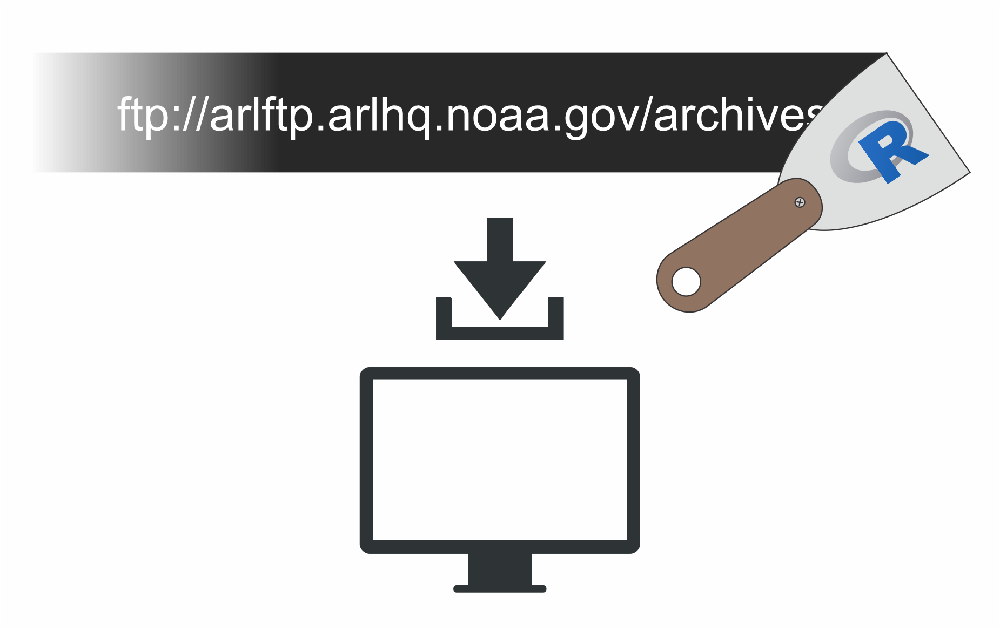

<!-- README.md is generated from README.Rmd. Please edit that file -->

# dlmet

<p align="center">

</p>
<!-- badges: start -->
<!-- badges: end -->

**From Chrome version 7 onward, Google began removing ftp support from
their browser. In early 2021, ftp support was completely removed.
Firefox and Edge are following suit. As a result, the dlmet package no
longer works as intended (scraping NOAA ftp server file names). I am
leaving it up as a repository of useful RSelenium code for my other
projects. The remote webdriver still works! NOAA met data can be fetched
directly from NOAA servers via e.g. windows explorer.**

### Package description \[DEFUNCT: SEE ABOVE\]

**dlmet** was an **R** package built for web-scraping filenames from the
[NOAA ARL archive](%22https://www.ready.noaa.gov/archives.php%22).
Typically when a user seeks to download a piece of data from the [NOAA
ARL archive](%22https://www.ready.noaa.gov/archives.php%22), they
navigate to the file in question using a web browser and select
individual files for download. Downloading multiple files in this manner
can be very tedious. Additionally, the NOAA archive can sometimes be
inaccessible to standard web browsers for [some odd
reason](https://hysplitbbs.arl.noaa.gov/viewtopic.php?t=2103).

The **dlmet** package sped up this process considerably, at least within
R. Using two to three functions in a simple workflow, filenames could be
scraped from the NOAA archive, parsed, and used for a direct download
all in the R environment. **dlmet** uses
[**RSelenium**](https://cran.r-project.org/web/packages/RSelenium/index.html)
for the web-scraping of file names, ensuring that said file names are
current. The user could easily use the remote web client to download
files outside of the original scope for this package, which was to
download large volumes of [Global Data Assimilation
System](https://www.ready.noaa.gov/gdas1.php) meteorological data files
for use in the HYSPLIT model via
[splitr](https://github.com/rich-iannone/splitr).

This package has no affiliation with NOAA.

## A simple tutorial

After installation (see below), the user can start up a remote client.
The default address is the NOAA archive.

    initiate_client()

After this, navigating to the desired subfolder of the archive is
straightforward.

    navigate_client("ftp://arlftp.arlhq.noaa.gov/archives/gdas1")

Scrape all the objects within the page html table.

    gdas1_all_items <- grab_objects_onpage()

All the entries on the gdas1 page, including file sizes, the dates they
were modified, and the type of entry (i.e. ‘file’ or ‘folder’) are now
stored in the Global Environment. After this, we can target specific
time periods. e.g. April 2015:

    # Cut out tertiary files (i.e. non-standard-met data).
    gdas1_all_items <- gdas1_all_items[-(1:12), , drop = TRUE] # First 12 rows are not standard met files.
    gdas1_filenames <- gdas1_all_items[-((nrow(gdas1_all_items)-3):(nrow(gdas1_all_items))), , drop = TRUE] # last 4 files are admin files, not met.
    # Use grep to target rows for April 2015.
    gdas1_April_2015 <- gdas1_filenames[grep("apr15", gdas1_filenames$Name), ]

Now pass this data frame to the download function to get those
meteorological files. This function can take a dataframe (such as that
returned by grab_objects_onpage), a matrix, or a character vector. If
the client is still on the same page, the function current_URL() can be
used to easily direct the download function to the current webpage where
the files are stored.

    dlmet_download(filenames = gdas1_April_2015,
                   dl_directory = "D:/TEMP",
                   page_url = current_URL(),
                   verbose = TRUE,
                   suppress_download_popups = TRUE)

Finally, the client should be closed properly to prevent orphaned
processes (such as Java) from chewing up system memory.

    terminate_client()

That’s it! The web scraping functions work by accessing and parsing the
XML/HTML contents of the web page. This portion of the functions could
be adapted to other web pages, and thus other archives. If you would
like to expand upon or suggest improvements to this capability, feel
free to fork this package or get in touch.

## Installation

**dlmet** requires a few things to work.
[**R**](https://cran.r-project.org/bin/windows/base/) must be installed,
along with
[**java**](https://www.java.com/en/download/help/download_options.html)
and [**Google Chrome**](https://www.google.com.au/intl/en_au/chrome/).
You will also need to download the
[chromedriver](https://chromedriver.chromium.org/downloads) that matches
your version of Chrome.

**dlmet** is hosted on github, and can be installed via the **devtools**
package.

``` r
devtools::install_github("MRPHarris/dlmet")
```

#### Notes on OS compatibility

Currently **dlmet** is only tested for Windows. It is unlikely to work
on Mac or any other OS at the moment, for a few key reasons. However,
these incompatibilities could be ironed out in a subsequent version of
the package - I just don’t have access to a Mac.

1)  Terminating a WebDriver client requires a system() call that ends
    java processes on the system. I am unfamiliar with system commands
    on other operating systems, but I assume (perhaps incorrectly) that
    the syntax and process is a bit different.

2)  Installation + running of RSelenium on Mac requires the user to jump
    a few [extra
    hoops](https://stackoverflow.com/questions/50880725/rselenium-installation-on-macbook-with-chrome).
